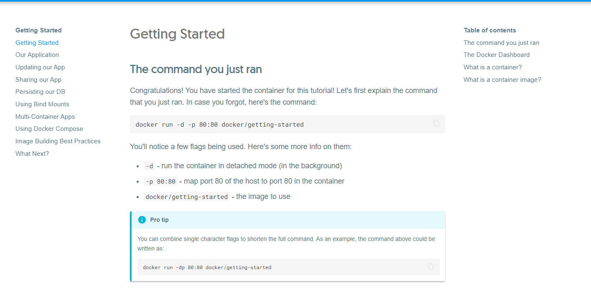

# Demo

## Install Docker

Make sure to create a back-up of you system beforehand, just in case. 

Follow the instructions on (this page)[https://docs.docker.com/get-docker/]

## Your first container

Open up GitBash and type out 
```
docker run -d -p 80:80 docker/getting-started
```

Navigate to Docker Desktop and we should see the container on our list of containers. To see what's happening, hover over the container and click on "Open in Browser". You should be able to see a page that looks like this:



## Building a Container

1. A container is pretty useless if don't have any code to run, so let's download the [app](https://github.com/docker/getting-started/tree/master/app). 

2. Create a file named "Dockerfile" in the directory with the "package.json" file. Make sure there are no file extensions (.txt, .md, etc.). It should just be "Dockerfile"). Put this in the file:

```
# syntax=docker/dockerfile:1
FROM node:12-alpine
RUN apk add --no-cache python2 g++ make
WORKDIR /app
COPY . .
RUN yarn install --production
CMD ["node", "src/index.js"]
```

Even if we don't have Node on our machine, the image will be downloaded so we can still run the app.

We can examine the contents of the Dockerfile one by one:
- ```FROM node:12-alpine``` specifies that the node:12-alpine image is the parent image from which we are building our own image.
- ```RUN apk add --no-cache python2 g++ make``` allows us to run the specified command.
- ```WORKDIR /app``` sets our default working directory to the folder "app".
- ```COPY . .``` copies the path from the context into the container.
- ```RUN yarn install --production``` uses yarn to install the application's dependencies.
- ```CMD ["node", "src/index.js"]``` specifies the default command to run when starting a container from this image. In this case, we use node to start up the website. 

3. Open a bash terminal in the same directory as the newly created Dockerfile and run ```docker build -t getting-started .``` We can replace "getting-started" with anything, this is just the name of the container, as flagged by "-t". Here we are building the image from the Dockerfile. 

4. We can start the container with 
```
docker run -dp 3000:3000 getting-started
```
in the terminal. Here we are running the container based on the image that we already created. 

5. Navigate to http://localhost:3000 and you should be able to interact with the website, with no need to install any of the required technologies manually!

## Docker Hub Tutorial

1. Create a Docker [account](https://hub.docker.com/signup) and sign in. 

2. Create a repository on Docker Hub and give it a fitting name (test-repo, etc.)

3. Install Docker Desktop if you haven't already and sign in using your new account. 

4. Create a container image using a Dockerfile. 

```
FROM busybox
CMD echo "My first Docker Image."
```

5. Run some commands:
```
docker build -t <your_username>/<repo-name> . 

docker run <your_username>/<repo-name>

docker push <your_username>/<repo-name>
```

6. You should see your image on Docker Hub by navigating to your repositories on the Docker Hub website. 

7. To pull an image from Docker Hub, we can do

```
docker pull <username>/<repo-name>
```

We can use rocker/verse as an example. 

```
docker pull rocker/verse
```

Finally, type out 

```
docker images
```

and confirm that we can see rocker/verse on the list. 

