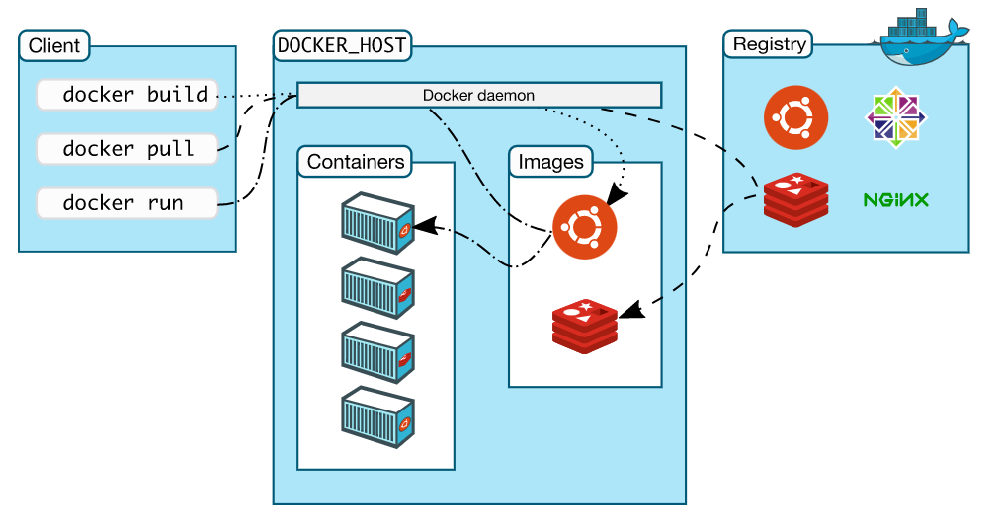

# Docker

[Reference for all things Docker](https://docs.docker.com/)

## Containers

A container is a mechanism for packaging an application(or limited number of processes) with its dependencies so that it runs in its own isolated sandbox.

Containerization helps to ensure the application or set of processes can run reliably regardless of the host environment. The container shouldn't be able to modify or interact with it anything it doesn't need and, on the whole, changes in the container should not effect the Host or other containers (and vice versa).


## Some important Definitions:

1. Image - an immutable file that contains the source code, libraries, and everyting else an application needs to run. 
2. Container - a virutalized run-time environment that is isolated from the host system as well as other containers
3. Dockerfile - includes the commands used to assemble an image

## Docker Benefits
1. Lightweight - Docker only installs the dependencies that are required for the given container, doesn't include its own operating system. Therefore Docker containers are much quicker to create and start than virtual machines. 
2. Mobility - Docker containers can be run on any machine, and developers can be assured that they will work the same, regardless of the environment of the host machine. 
3. Modularity - Containerization allows developers to segment an application so they can work on specific parts, without taking down or affecting the entire application. 

## Docker Architecture

Taken from [here](https://docs.docker.com/get-started/overview/). We see from the diagram that the client communicates with the Docker daemon which then performs the building, running, and distributing of the Docker containers. 



A Docker image contains multiple layers. When a Docker image is rebuilt, only the changed layers are rebuilt, therefore making Docker images and containers more lightweight. 

## Containers vs Virtual Machines (VMs)

Containers are much more ligthweight than VMs. They are built on top of the host operating system's kernel. They only contain Apps and Services. 


Virtual Machines run a complete operating system, including its own kernel.


## Dockerfile

A Dockerfile includes instructions on how to create a certain image. For example if wanted to run a web app in our container, our Dockerfile should contain all the instructions on how to install node, configure the working directory, and install any other dependencies. 

- FROM - must be the first instruction in a Dockerfile, specifies the parent image from which the current image is being built
- RUN - runs a command in a new layer in top of the current image and commits the results
- CMD - provide default instructions for startin a container
- EXPOSE - instructs the container on which port to listen to at runtime
- ADD - copies new files, directories, or remote file URLs from the local machine to the container filesystem
- COPY - similar to ADD, but doesn't support URLs as a source
- ENTRYPOINT - allows you to configure a container that will run as an executable

## Docker commands

These are the commands that you can run in your terminal to build and run docker containers

- docker build - builds an image from a Docker file
- docker run - runs a command in a new container
- docker images - shows a list of all images 
- docker pull - pulls an image from a registry
- docker push - pushes an image to a registry
- docker ps - lists all containers

Find more commands [here](https://docs.docker.com/engine/reference/commandline/docker/)

## Docker Compose

Compose is used for creating and running multi-container applications. Once you configure the application's services via a YAML file, you can start up all the services will a single command. 

1. Define the app's environment with a Dockerfile. 
2. Define the services that make up your app in docker-compose.yml. 
3. Run ```docker compose up```. 

## Docker Volumes

Docker containers have a "virtual file system", meaning that when a container stops, its data is lost. Docker volumes allows us to persist the data on the host machine so it is not lost. There are other ways to persist data, such as mounts. However, Volumes persist data to the part of the host filesystem that is managed by Docker. Therefore volumes are the most recommended way to persist data in Docker. 

Read more about [Docker storage](https://docs.docker.com/storage/) and [volumes](https://docs.docker.com/storage/volumes/)

## Docker Daemons

